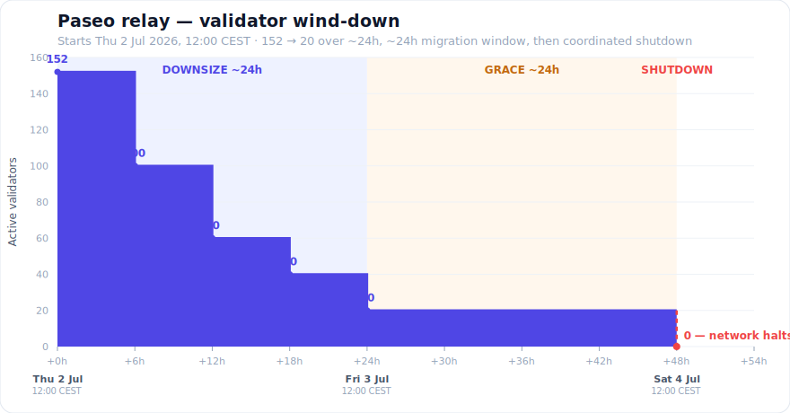
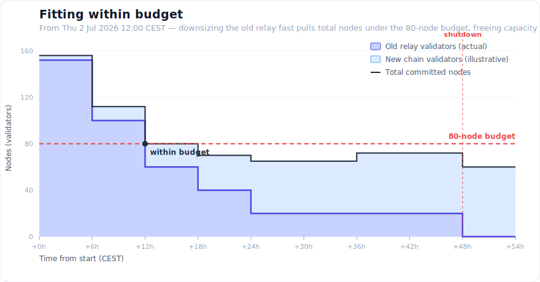

# 📢 Paseo Testnet — Relay Downsizing & Sunset

**We are winding down the current Paseo relay chain and moving to a new,
right-sized replacement chain launched in parallel.**

> **Start: Thursday 2 July 2026, 12:00 CEST (10:00 UTC).**
> The old relay is fully shut down about **48 hours later — Saturday 4 July, 12:00 CEST.**
> **➡️ Migrate to the new chain before then.**

---

## TL;DR

- We shrink the old relay **as fast as the network safely allows** (one change
  every 6h) — from **152 validators down to 20** in ~24h — to get back within our
  infrastructure budget and free capacity for the new chain.
- Then we hold at a minimal **20 validators for ~24h** as a **migration window**,
  so teams and users can move over. Parachains keep producing blocks the whole
  time (just slower).
- Finally, the old relay is **shut down** — validators stop their nodes and the
  chain halts.
- **No surprise downtime.** Finality never breaks during the wind-down; the only
  outage is the planned shutdown at the end.

## What it looks like

We drop validators in four steps over the first day, hold at 20, then shut down.
Group security is kept constant (5 validators per backing group) at every step,
so the chain stays safe the whole way down.

Our total budget is **80 nodes** across *both* chains. The old relay is currently
over that on its own, so we downsize it quickly — that pulls the total back under
budget and lets the **new chain grow** into the freed capacity. (New-chain growth
shown is illustrative.)

---

## Schedule (all times CEST)

| # | When | Validators | Cores | What happens |
|---|------|-----------:|------:|--------------|
| — | **Thu 2 Jul, 12:00** | 152 | 56 | **Start** — normal operation |
| 1 | Thu 2 Jul, 18:00 | 100 | 20 | first cut; consolidation begins |
| 2 | Fri 3 Jul, 00:00 | 60 | 12 | parachain blocks start to slow |
| 3 | Fri 3 Jul, 06:00 | 40 | 8 | further consolidation |
| 4 | **Fri 3 Jul, 12:00** | **20** | 4 | **floor reached** — migration window opens |
| — | Fri 3 Jul → Sat 4 Jul | 20 | 4 | **grace window** — migrate now |
| 5 | **Sat 4 Jul, 12:00** | — | — | **🔻 shutdown** — nodes stop, chain halts |

*The migration window may be extended (shutdown moves to Sunday 5 July) if the
community needs more time — we'll announce any change. The live dashboard always
shows the current schedule.*

---

## What this means for you

**🧩 Parachain teams**
- Your chain **keeps producing blocks** during the wind-down, at a slower cadence
  (~30–60s between blocks; Asset Hub stays near-normal on its own core).
- **At shutdown (Sat 4 Jul, 12:00 CEST) it stops permanently.** Redeploy /
  register on the new chain before then. Need a bigger core share or more time?
  Reach out.

**👤 Users & developers**
- Expect slower confirmations on the old chain during the wind-down.
- Move your activity and testing to the new chain before shutdown.

**🛡️ Validators**
- If you're being offboarded: you'll be **chilled first (no slashing)** and rotate
  out cleanly at an era boundary. **Don't stop your node until we confirm** you've
  rotated out.
- If you're in the final group of 20: keep running to the end, then **stop your
  node on the coordinated shutdown signal**.

**🔌 RPC / infra operators**
- Old-chain endpoints serve until shutdown, then can be repointed to the new chain.

---

## FAQ

**Why downsize so fast?**
The old relay is over our 80-node budget on its own. Downsizing quickly frees
infrastructure for the replacement chain while still leaving a migration window.

**Will finality or block production break?**
No. Validators are only removed at era boundaries, group security is held at 5,
and the schedule **auto-pauses** if finality health degrades. Parachains slow down
but don't stop until the final shutdown.

**What does "shutdown" actually mean — is there a button?**
No on-chain "stop the network" call exists — a chain runs as long as its validators
run. At the shutdown milestone, validator operators **stop their nodes** in a
coordinated way; the chain then stops finalizing and producing blocks. It's an
operational step, announced ahead of time with the exact block/time.

**What happens to my funds / state on the old chain?**
The old chain is a **testnet** being retired. Move anything you need to the new
chain before shutdown; the old chain is unusable afterward.

**Can I follow along live?**
Yes — a public dashboard shows the current validator count, cores, per-chain block
cadence, the step timeline with countdowns, and every action taken. _(link)_

---

## ✅ Action required

**Migrate to the new Paseo chain before Saturday 4 July 2026, 12:00 CEST.**

Questions, a larger core share, or more migration time → reach the Paseo
maintainers: _(add Matrix/Element + email/forum links here)_.
